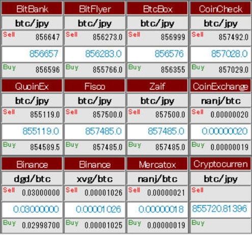
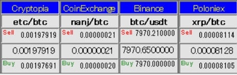

# Namboja
Namboja (なんぼじゃー)は仮想通貨の価格を表示するフリーソフトです。　

*Namboja*

*NambojaLite*

・	Namboja　NambojaLiteは　国内外の取引所の仮想通貨の価格を取得・表示します。  
    Eth,Ltc,Xrpなどの有名アルトコインはもちろんNanj,Vips等取引所に上場されている草コインも表示できます。  
・	アビトラージ用に、同一通貨ペアを最大12取引所、表示できます。  
・	データ分析のため、取得した値はCSV形式またはJSON形式にて保存可能です。  

[Namboja ダウンロード](Namboja/NambojaZip/Namboja_Ver1.00.zip)

**対応取引所(2018/05/25)**  
*(国内)*  
BitBank , BitFlyer , BtcBox , CoinCheck , Fisco , QuoinEx , Zaif  
*(海外)*  
BiBox , Binance , Bittrex , CoinExchange , CryptocurrencyMarketCap , Cryptopia , GateIo ,  
HitBTC , Houbi , Kraken , Mercatox , Poloniex ,(Ver1.01で追加)TradeSatoshi , StcoksExchange ,
CoinEgg , AEX.com , ZB.com 

*(追加予定の取引所)*  
未定

**動作環境**　：　Windows 10(64bit) 

**使用許諾**  ：  
・NambojaおよびNambojaLiteはフリー・ソフトウエアです。個人使用、業務使用に関わらず自由に使用してかまいません。  
・NambojaおよびNambojaLiteの動作に必要なファイルが含まれた形であれば、自由に複製し、頒布してかまいません。  
・ソフトウエアは十分にテストをしていますが、お使いのパソコン環境や、プログラムの不具合などによって問題が生じる場合があります。  
 それ により損害が生 じても、損害に対する保証は出来かねますので、あらかじめご了承ください。  

不具合報告・要望・取引所追加リクエスト等　問い合わせ先  
Mail　　:　<taroko.honpo@gmail.com>  
Twitter　:　<https://twitter.com/THonpo>  

**寄付について**  
仮想通貨での寄付歓迎いたします。  

 通貨	   アドレス  
*BTC*　 :　15MugbuE7rzJx7jr4XGW7YmdVqvZXhm1x5  
*MONA*  :　MBfdDfNi8e472DpDyup7YkhJMFDWW1avRH    
*LTC*　 :　LWp7sHz95kibV6epw55QXqThZg3mBjg1fn  
*ETH*　 :　0xE7846cda44a15fD78B9F108F0B4d5bf38B492585  
*NANJ*　:　0xB616E5606ccc9582c8dE155E6d95316969b888e0  
  
上記以外の通貨(塩漬け状態の草コインも可)でもご連絡いただければ用意いたします。

